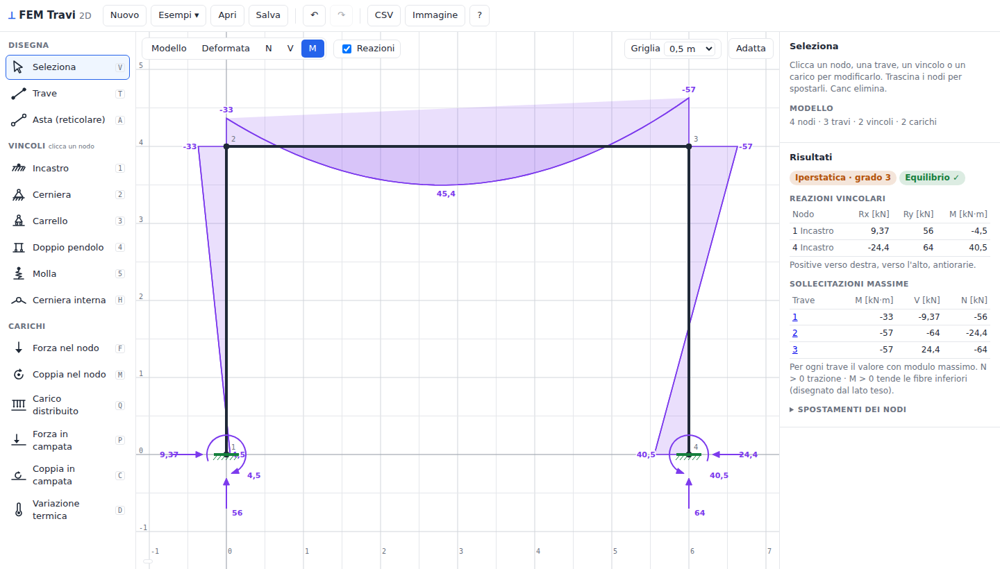
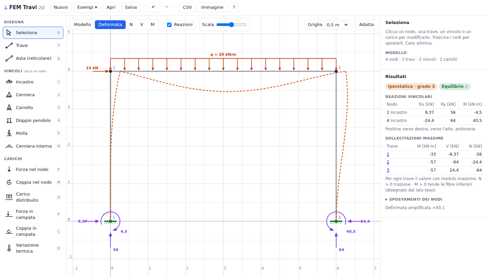
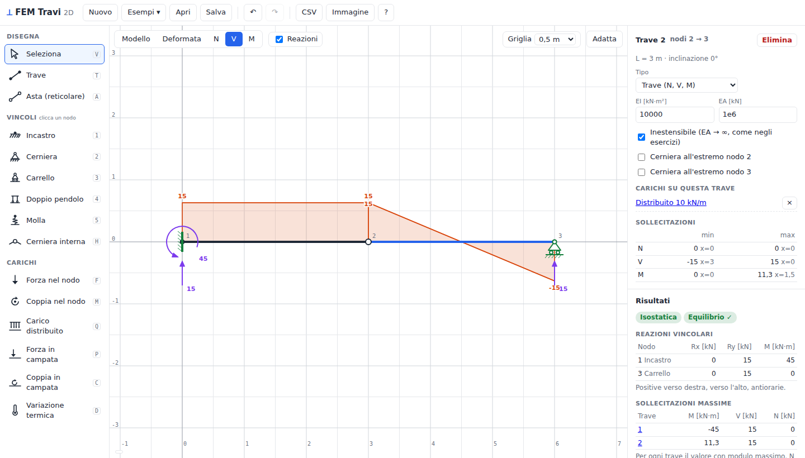
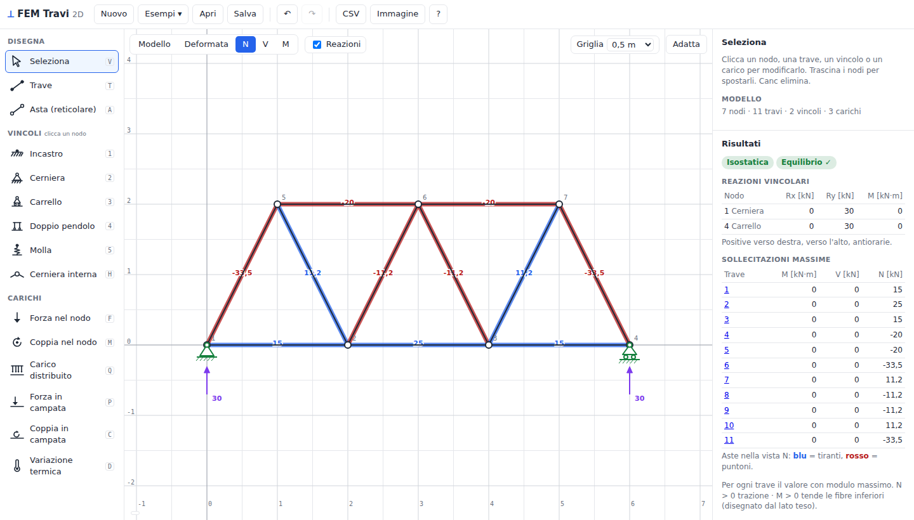
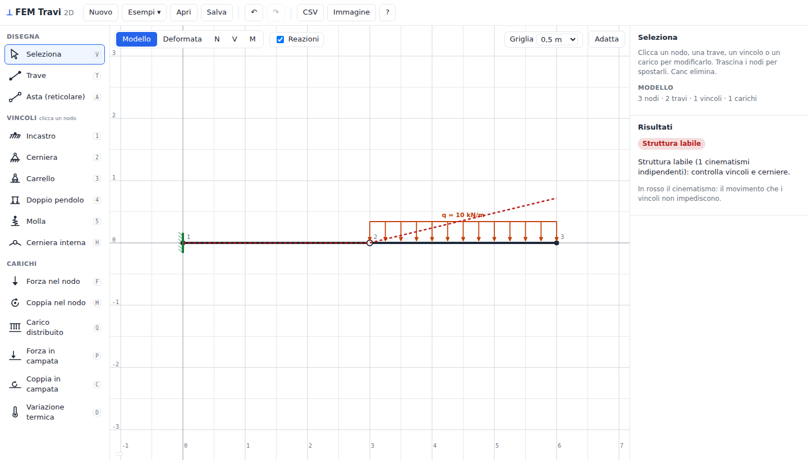

# Risolutore-FEM-python

Fem-travi è un risolutore bidimensionale basato sul metodo degli elementi finiti (FEM).

Il progetto nasce dall'esigenza pratica di avere uno strumento di visualizzazione per la risoluzione di esercizi e prove d'esame di meccanica dei solidi. Lo strumento permette di verificare rapidamente spostamenti, reazioni vincolari e diagrammi delle sollecitazioni iperstatiche.



| | |
|---|---|
|  |  |
|  |  |

## Novità della versione 2

- **Nuova interfaccia grafica** nel browser: si disegnano le travi con il mouse, i vincoli si scelgono da una palette che spiega cosa bloccano, e il calcolo si aggiorna a ogni modifica.
- **Diagrammi esatti** di N, V, M anche con carichi in campata: sotto un carico distribuito il momento è la parabola corretta (nella v1 era lineare, quindi sbagliato).
- **Aste reticolari e cerniere interne**: le capriate ora si risolvono (nella v1 davano "struttura labile").
- **Vincoli completi**: incastro, cerniera, carrello (anche su piano inclinato), doppio pendolo, molle, cedimenti vincolari.
- **Carichi**: forze e coppie nei nodi e in campata, distribuiti uniformi, triangolari e trapezoidali (verticali, orizzontali, perpendicolari all'asse o riferiti alla proiezione), variazioni termiche uniformi e a farfalla.
- **Grado di iperstaticità e di labilità** calcolati dal rango della matrice di equilibrio; se la struttura è labile viene mostrato il cinematismo.
- **Esportazione** dei risultati in CSV (si apre direttamente in Excel) e del disegno in PNG.
- Convenzione di segno unica in tutta la libreria, 46 test contro soluzioni analitiche, CI su GitHub.

## Funzionalità principali

- **Modellazione fisica**: trave di Eulero-Bernoulli con 3 gdl per nodo (u<sub>x</sub>, u<sub>y</sub>, φ).
- **Carichi complessi**: forze nodali, momenti, carichi distribuiti, carichi in campata e termici.
- **Analisi iperstatica**: risoluzione del sistema globale tramite matrici di rigidezza ruotate e assemblate.
- **Verifica**: calcolo delle reazioni vincolari e successiva verifica dell'equilibrio (forze e momento).
- **Interfaccia grafica (GUI)**: strumento visivo interattivo per la costruizione del modello e la verifica.

## Installazione

Il progetto è pensato come un pacchetto Python installabile.

```bash
git clone https://github.com/Mariglend/Risolutore-FEM-python.git
cd Risolutore-FEM-python
pip install -e ".[dev]"
```

L'unica dipendenza obbligatoria è `numpy`; `matplotlib` serve solo per i grafici da script.

## Utilizzo

Il progetto è pensato per essere utilizzato sia come libreria Python che tramite l'interfaccia dedicata.

### Interfaccia grafica

```bash
fem-travi            # oppure: python -m fem_travi
```

Si apre il browser con l'interfaccia (il calcolo gira in locale, non serve internet).

| Azione | Come |
|---|---|
| Disegnare travi | strumento **Trave** (T), click sui punti; Esc per finire. Shift blocca l'angolo a 45°, Alt sgancia dalla griglia |
| Spezzare una trave | disegnando, clicca su un punto della trave esistente |
| Mettere un vincolo | scegli il vincolo (tasti 1–5) e clicca il nodo; clicca di nuovo per ruotarlo di 90° |
| Cerniera interna | strumento **Cerniera interna** (H) sul nodo, oppure "cerniera all'estremo" sulla singola trave |
| Carichi | imposta intensità e verso nel pannello a destra, poi clicca nodo o trave |
| Modificare / eliminare | strumento **Seleziona** (V), click sull'oggetto; Canc elimina; i nodi si trascinano |
| Risultati | pulsanti Deformata · N · V · M; tabelle di reazioni e sollecitazioni a destra |
| Salvare | **Salva** produce un `.json` che si riapre sia nell'interfaccia sia da Python |

### Script rapido

```python
from fem_travi import Struttura

s = Struttura()
a, b = s.nodo(0, 0), s.nodo(6, 0)
t = s.trave(a, b, EI=1e4, EA=1e6)
s.cerniera(a)
s.carrello(b)
s.carico_distribuito(t, -10)       # 10 kN/m verso il basso

r = s.risolvi()
r.stampa()
print(r.estremi(t)["M"]["max"])    # 45.0 = qL²/8
```

Altri comandi utili:

```python
s.incastro(n); s.doppio_pendolo(n, angolo=90); s.carrello(n, angolo=30); s.molla(n, ky=1e3)
s.cerniera_interna(n); s.asta(i, j, EA=1e5)
s.forza(n, Fx=0, Fy=-20); s.coppia(n, M=5)
s.carico_distribuito(t, qi=-10, qj=-20, direzione="y", proiezione=False)
s.forza_in_campata(t, a=2.0, Fy=-15); s.coppia_in_campata(t, a=3.0, M=10)
s.carico_termico(t, alpha=1.2e-5, dT=20, dT_farfalla=10, h=0.4)
s.cedimento(n, y=-0.01)

r.reazioni()             # {nodo: {"Rx", "Ry", "M", ...}}
r.sollecitazioni(t)      # {"x", "N", "V", "M"} lungo la trave
r.deformata(t)           # coordinate della deformata
r.grado_iperstaticita

from fem_travi import esporta_csv, carica_json, plot_struttura, plot_diagrammi
esporta_csv(r, "risultati.csv")
```

Esempi completi in [`examples/esempi_v2.py`](examples/esempi_v2.py). Gli script scritti per la v1 (`Nodo`, `Trave`, `Vincolo`, `Carico(...)`) continuano a funzionare: vedi [`examples/esempi.py`](examples/esempi.py).

### Convenzioni di segno

- Assi globali: x verso destra, y verso l'alto; rotazioni e coppie positive se antiorarie.
- Forze e carichi positivi nel verso degli assi: un carico verso il basso è negativo.
- N > 0 trazione; M > 0 se tende le fibre inferiori (lato −y locale), e il diagramma è disegnato dal lato teso; V = dM/dx.
- Unità consigliate: kN, m.

## Validazione e metodologia

Il solver utilizza il metodo della rigidezza diretta. I carichi in campata sono trasformati in forze nodali equivalenti esatte e le sollecitazioni sono ricostruite per equilibrio a partire dalle forze di estremità. Le cerniere interne sono trattate per condensazione statica. I vincoli (anche inclinati e con cedimenti) sono imposti con il metodo del nucleo, che permette anche di riconoscere e mostrare i cinematismi.

La validazione è stata fatta confrontando i risultati con soluzioni analitiche di prove d'esame che coprono:

1. Trave appoggiata e a sbalzo
2. Telai e portali iperstatici
3. Verifica della simmetria e della definizione positiva della matrice K globale

I test automatici (`pytest`) aggiungono: trave incastrata-incastrata, trave Gerber, trave continua, arco a tre cerniere, capriata Pratt (metodo di Ritter), carrello inclinato, doppio pendolo, molle, cedimenti e carichi termici.

```bash
pytest
```

## Struttura del repository

```
fem_travi/          libreria (core, assembler, solver, io, plotter)
fem_travi/app/      interfaccia grafica (server locale + pagina web)
tests/              test contro soluzioni analitiche
examples/           esempi da script
legacy/             GUI tkinter della v1 e vecchia documentazione
Risultati/          esempi di risultati della v1
```

OSS: Questo progetto è stato sviluppato per scopi didattici; sebbene i risultati siano stati validati si consiglia un controllo critico dei risultati.
